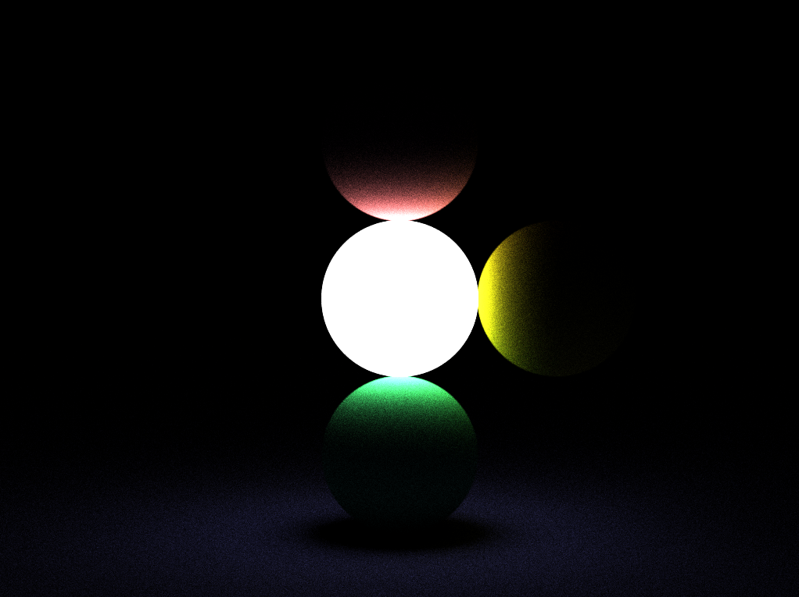
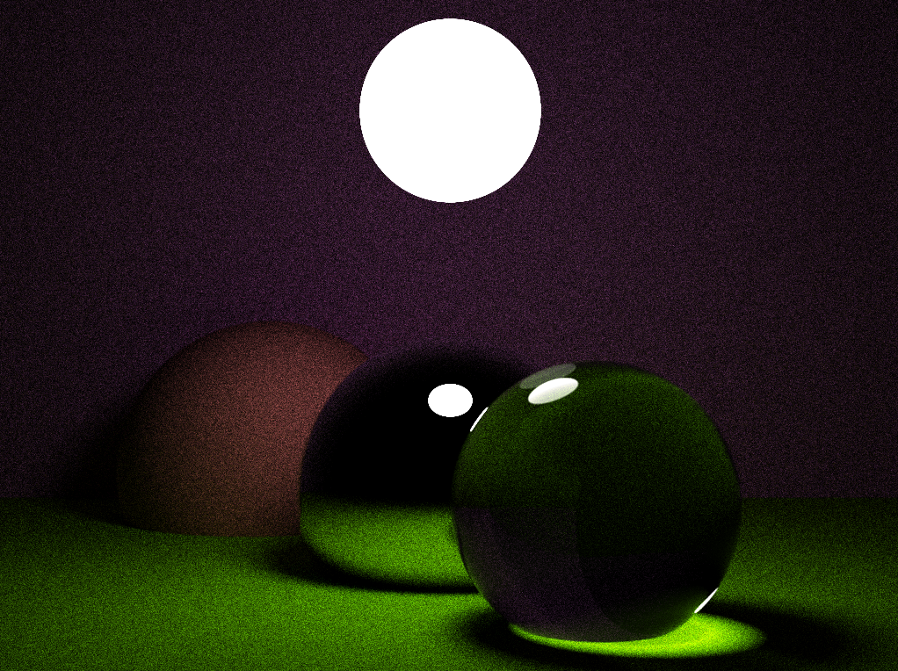

# Simple Raytracing Renderer

## Result
64 spp 4 depth 4 subpixels

64 spp 4 depth 8 subpixels

## Features
  -	Raytracing based global illumination.
  - Multithread accelerating.
  - Customable geometry class interface.Sphere and plane are precluded.
  - Configurable material class and customable ray reflection or transmission behaviours, supporting multiple weighted rays combination. Ideal diffusal, reflectal and refractal materials are precluded.

## Usage

### Render
```C++
#include "Rendering/Renderer.hpp"
#include <vector>
#include <memory>
//configure the renderer properties
RendererDescription desc;
desc.Width = 1024;
desc.Height = 768;
...
//Init Renderer instance
Renderer renderer(desc);

//Init scene, which is an array storing object datas
std::vector<Object> scene;
//Add objects to scene
scene.emplace_back(
	std::make_shared<Sphere>(...),std::make_shared<DiffusalMaterial>(...));
...

//Init camera object
Camera camera(...);

//Call Render
renderer.Render(scene,camera);

```

### Custom Geo
```C++
#include "Geometry/Geometry.hpp"
class CustomGeo : public Geometry
{
	...//Finish pure virtual functions
}
```

### Custom Material
```C++
#include "Rendering/Material.hpp"
class CustomMaterial : public Material
{
	...//Finish pure virtual functions
}
```

